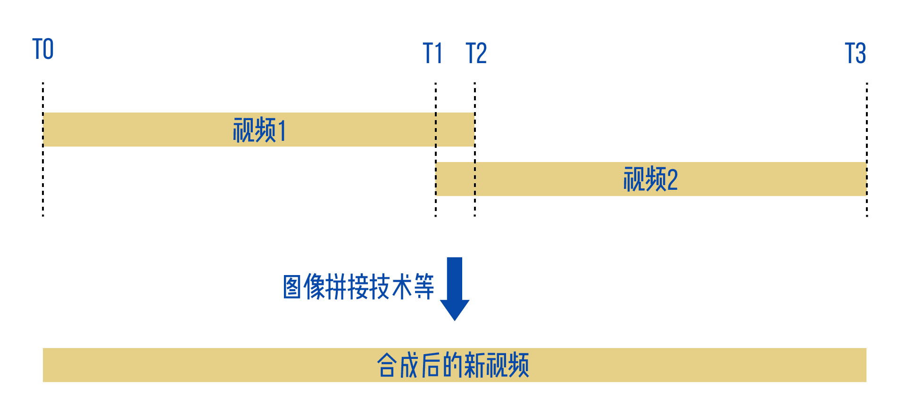
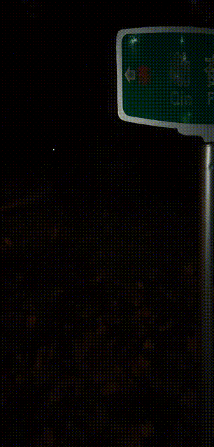

# Computer-Vision-Slacker

[TOC]

## 小组成员

王原龙 PB18111781

赵振宇 PB18020733

## 选题

**基于图像拼接的视频拼接实现**

## 使用说明

为运行此程序，需要将待拼接的视频放入项目根目录，命名为`01.mp4`和`02.mp4`，并在`main.py`当中设置时间`t1`，为第一段视频不需拼接部分所占时长（如下面功能部分示意图所示），运行程序即可，程序将输出视频`videoOut.avi`

在`examples/street_sign`目录下有示例视频，`examples`其余子目录下为图像拼接示例

## 功能

利用图像拼接技术，将两段视频进行首尾拼接，达到视频拼接或者视频转场的效果

## 原理

1. 在两段视频重合的区域（t1, t2），将两段视频对应的帧进行预处理，得到图像拼接所需的单应矩阵H

2. 图像拼接，其具体流程为：
   寻找特征点->特征点匹配->去除匹配效果不好的点->根据匹配点计算H矩阵->图像拼接

   示例如下图所示：

   
 特征识别

   
 特征点匹配

   
 特征点筛选过滤

   
 图像拼接结果

3. 由于处理后的视频画面应当是连续的，所以对这一系列矩阵H做相应的处理（可以认为是平滑操作）

  

4. 为了保证处理后视频画面的连续性，所以在图像拼接之后作裁剪，使得视频画面连续自然。

## 技术细节

### 单应矩阵

在常规的图像拼接算法中，两个图像img1、img2在经过匹配之后得到一个对应的单应矩阵H，则拼接后的图像是来自于I\*img1和H\*img2的（I为单位矩阵）。实际含义为：保持img1的视角不变，将img2的视角进行调整，以匹配img1。

但为了保证视频拼接的连续性，所需的视角需要连续变化，也就是由第一个视频逐渐过渡到第二个视频。同时，画面中来自图像1的像素占比逐渐减小，来自图像2的像素占比逐渐增大。整体上，不管是视角变化还是像素占比的变化，都可以用一个权重$a$来描述：

- 当 $a=0$ 时，视角和图像1的视角相同，且输出画面全部为图像1的画面

- 当 $a=1$ 时，视角和图像2的视角相同，且输出画面全部为图像2的画面

- 当 $0<a<1$ 时，视角在图像1和图像2之间，由a决定

输出画面是部分图像1和部分图像2的叠加，也由a决定

具体说来，设图像1和图像2的变换矩阵为 $A_1$ 和 $A_2$ ，则：

- 当 $a=0$ 时，$A_1=I$，$A_2=H$

- 当 $a=1$ 时，$A_1=H^{-1}$，$A_2=I$

- 当 $0<a<1$ 时，在 $A_1$ 和 $A_2$ 上乘一个变换矩阵 $(I+a\cdot(H^{-1}-I))$，则有

  $A_1=I+a\cdot(H^{-1}-I)$，$A_2=H+a\cdot(I-H)$

### 预处理

当像素过高时，`cv2.SIFT_create().detectAndCompute()`特征点识别方法会将微小细节过度识别，为解决此问题，实际计算H矩阵时用到的是处理过后的低分辨率图像（此参数可调整）。这样在视频处理时忽略细节，在大多数情况下可以得到更有用的识别结果（可以举个例子）。同时，这也减小了运算量，提高速度。

由于视频逐帧处理时，有可能在时间上存在抖动，这样输出的视频会有卡顿，因此对H矩阵进行平滑操作。

### 视频裁剪策略

为了保证输出画面的取景框是比较连续的，所以需要对视频作出裁剪。

裁剪的参数有两个，一个是裁剪过画面的中心坐标，一个是裁剪画面的长（由于比例是固定的，所以确定画面长度以后就可以确定宽度）

中心坐标由画面1的中心坐标、画面2的中心坐标以及权重a来决定。

裁剪画面的长度是这样确定的：

1. 以中心坐标为中心向外扩张取景框，直到无法扩张为止（即，碰到了黑边），得到一个预选的长度h0
2. 为了保证裁剪的连续性，对帧序列的h0平滑处理

## 实现效果

由于平滑部分没来得及实现，同时拼图部分性能有限，已经得到的结果效果如下图所示

	
	
 原视频

	
 输出视频

## 前景展望

目前未完成的项目：H矩阵和h0的平滑处理

未来可以尝试的方向：

- 调整整体的颜色和光场，使拼接更加自然

- 关键帧提取以提高处理速度

- 声音的拼接

## 参考链接

[[1]特征检测](https://www.cnblogs.com/multhree/p/11296945.html#sift%E7%89%B9%E5%BE%81%E7%AE%80%E4%BB%8B)
[[2]RANSAC](https://zhuanlan.zhihu.com/p/36301702)

